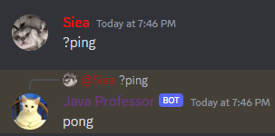

# JMJDA - The JM JDA expansion
Welcome to the JM JDA Expansion documentation!
This guide will walk you through the basics of creating a Discord bot using JM JDA Expansion, a tool developed by JM,
to simplify bot coding with JDA (Java Discord API).


### Setting Up Your Project
First, you need to create a new Java project in your favorite IDE (Integrated Development Environment) or text editor. 
Make sure you have JDA and JM JDA Expansion added as dependencies in your project.

You can add the JM JDA Expansion dependency to your pom.xml if you're using Maven:
```xml
<dependency>
    <groupId>com.vitacraft</groupId>
    <artifactId>jm-jda</artifactId>
    <version>1.0.0</version> <!-- Replace with the latest version -->
</dependency>
```

### Using JMJDA
Here's how you can create an empty bot using JM JDA Expansion:
```java
public static void main(String[] args) {
    JMBot bot = JMJDA.build("bot token here");
}
```
Yes, it is really that simple! With JM-JDA creating your empty bot is not longer than one line!

### Creating a Primitive Command
Now, let's create a simple "ping" command. We'll guide you through the process step by step.

#### Step 1: Create a Command Class
First, create a new Java class for your command. Let's name it `PingCommand`:
```java
public class PingCommand implements PrimitiveCommand {

    @Override
    public String getName() {
        return "ping";
    }

    @Override
    public String getDescription() {
        return "A simple Ping Pong command";
    }

    @Override
    public Permission[] getNeededPermissions() {
        return new Permission[0];
    }

    @Override
    public Channel[] getPermittedChannels() {
        return new Channel[0];
    }

    @Override
    public void execute(MessageReceivedEvent event, String[] args) {
        event.getMessage().reply("pong").queue();
    }

    @Override
    public void missingPermissions(MessageReceivedEvent event, String[] args) {
        event.getMessage().reply("You may not use this.").queue();
    }
}
```

#### Step 2: Register the Command
Next, you need to register the command in your main bot class like so:
```java
bot.getPrimitiveCommandsManager().registerCommand(new PingCommand());
```

